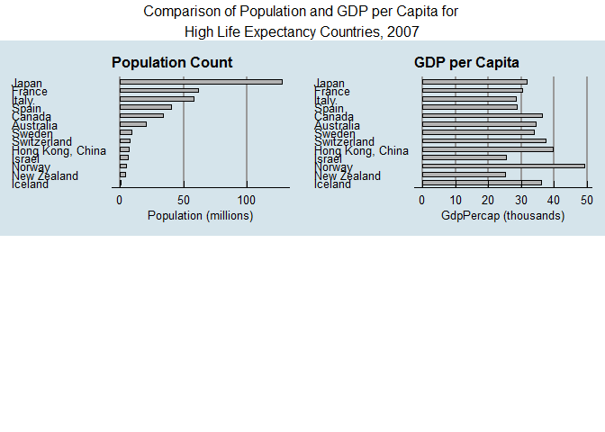
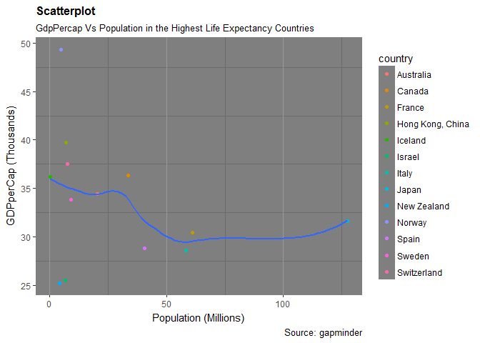
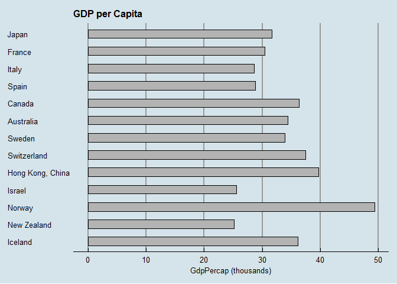
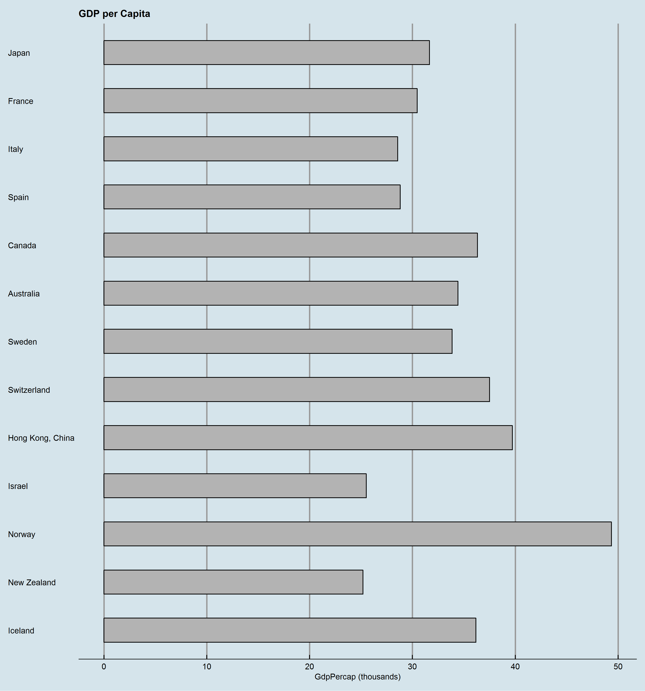
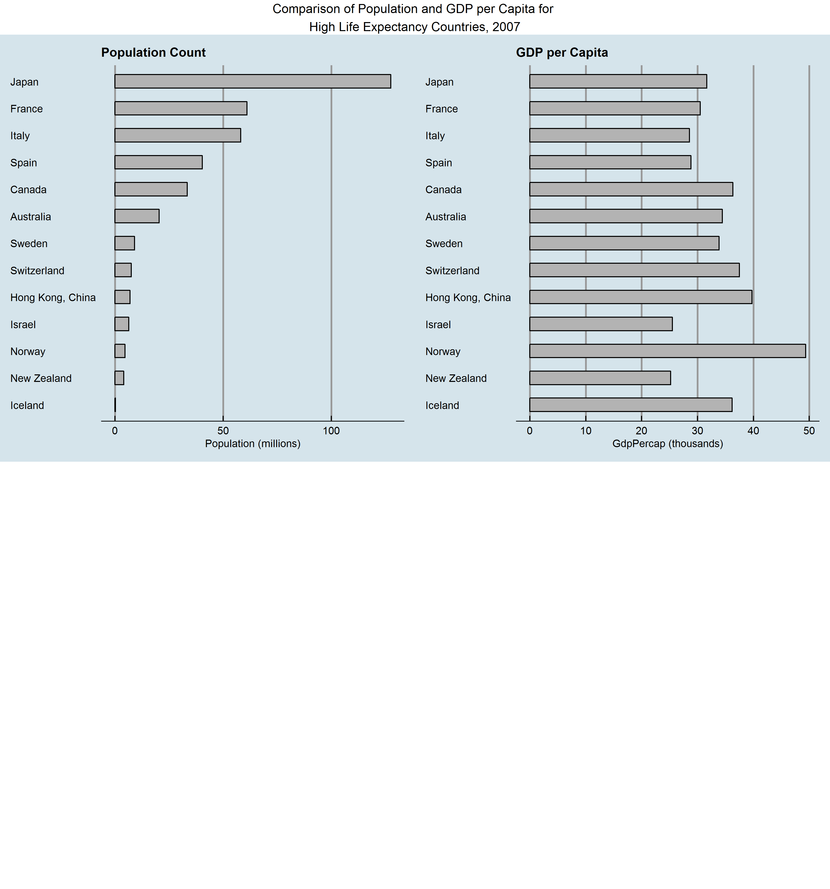
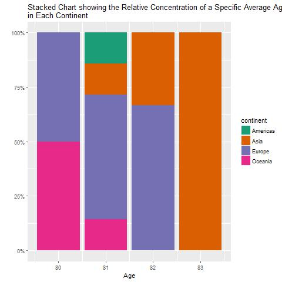
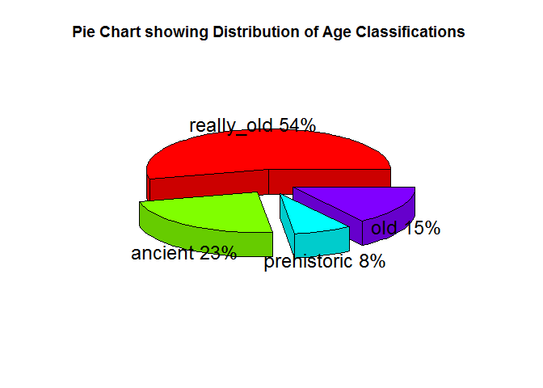

STAT545-HW05
================
Shirlett
October 16, 2017

-   [Factor Management](#factor-management)
    -   [Drop Factor Levels](#drop-factor-levels)
    -   [Reorder Factors](#reorder-factors)
    -   [Effect of Arranging Variables vs Reordering Factors on Graphs](#effect-of-arranging-variables-vs-reordering-factors-on-graphs)
-   [File Input and Output](#file-input-and-output)
    -   [CSV](#csv)
-   [Visualization](#visualization)
    -   [with Stacked Chart](#with-stacked-chart)
    -   [with Flipped Bar Charts](#with-flipped-bar-charts)
    -   [with ScatterPlot](#with-scatterplot)
-   [Graphic Devices](#graphic-devices)
    -   [Raster with ggsave- No Explicit Provision](#raster-with-ggsave--no-explicit-provision)
    -   [Raster with ggsave - With Explicit Provision](#raster-with-ggsave---with-explicit-provision)
    -   [Raster with jpeg](#raster-with-jpeg)
    -   [Vector](#vector)
-   [Extra Work: Factor Collapse with Recode](#extra-work-factor-collapse-with-recode)

Factor Management
=================

Drop Factor Levels
------------------

``` r
#First attempt to filter out Oceania from gapminder still retains all five of the

#original continents but produces only 1680 rows of observations which omits the 24

#associated with Oceania

no_ocean <- gapminder %>%
  filter(continent != "Oceania")
         
nlevels(no_ocean$continent) 
```

    ## [1] 5

``` r
nrow(no_ocean)   
```

    ## [1] 1680

``` r
#We also need to verify the data type of each of the variables to ensure that continent

#and/or country are factors
str(no_ocean)
```

    ## Classes 'tbl_df', 'tbl' and 'data.frame':    1680 obs. of  6 variables:
    ##  $ country  : Factor w/ 142 levels "Afghanistan",..: 1 1 1 1 1 1 1 1 1 1 ...
    ##  $ continent: Factor w/ 5 levels "Africa","Americas",..: 3 3 3 3 3 3 3 3 3 3 ...
    ##  $ year     : int  1952 1957 1962 1967 1972 1977 1982 1987 1992 1997 ...
    ##  $ lifeExp  : num  28.8 30.3 32 34 36.1 ...
    ##  $ pop      : int  8425333 9240934 10267083 11537966 13079460 14880372 12881816 13867957 16317921 22227415 ...
    ##  $ gdpPercap: num  779 821 853 836 740 ...

``` r
#Second attempt to only remove unused factor levels, ie unused continents results in

#only four continents to go with the 1680 observations

dropped_ocean <- no_ocean  %>%
    droplevels()

nlevels(dropped_ocean$continent) 
```

    ## [1] 4

``` r
nrow(dropped_ocean) 
```

    ## [1] 1680

Reorder Factors
---------------

``` r
#Order the countries by the standard deviation of the gdpPercap
f_order <- fct_reorder(dropped_ocean$continent, dropped_ocean$gdpPercap, sd)
levels(f_order)
```

    ## [1] "Africa"   "Americas" "Europe"   "Asia"

``` r
#The results are arranged in ascending order with Africa with the lowest standard

#deviation of gdpPercap and Asia with the highest
```

Effect of Arranging Variables vs Reordering Factors on Graphs
-------------------------------------------------------------

``` r
#Arrange only orients the values on the y-axis by the increase along gdpPercap
arr_ocean <- dropped_ocean %>%
               group_by(continent) %>%
               summarize(std_gdp=round(sd(gdpPercap), digits=2)) %>%
               arrange(std_gdp) %>%
               ggplot(aes(std_gdp, continent)) + 
               geom_point() + 
               labs(y= "Continent", x="Standard Deviation of GdpPerCap")


#Factoring only orients the values on the y-axis by the country's appearance in the

#list of factors

f_factor <- dropped_ocean %>%
                  group_by(continent) %>%
                  summarize(std_gdp=round(sd(gdpPercap), digits=2)) %>%
                  ggplot(aes(std_gdp, fct_reorder(continent,std_gdp)))+
                  geom_point() + 
                  labs(y= "Continent", x="Standard Deviation of GdpPerCap")


#Arrange the figures in a grid
grid.arrange(arr_ocean, f_factor,
             ncol=2,
             as.table=TRUE,
             heights=c(4,4),
             widths=c(14, 14),
             top="Comparison of Arrange vs Factoring")
```


``` r
#Combining Arrange and factoring produces the same result as factoring alone, so that

#arrange becomes redundant

arr_and_fac <- dropped_ocean %>%
               group_by(continent) %>%
               summarize(std_gdp=round(sd(gdpPercap), digits=2)) %>%
               arrange(std_gdp) %>%
               ggplot(aes(std_gdp, fct_reorder(continent,std_gdp))) +                                 geom_point() + 
               labs(y= "Continent", x="Standard Deviation of GdpPerCap")
  

grid.arrange(f_factor,arr_and_fac,
             ncol=2,
             as.table=TRUE,
             heights=c(4,4),
             widths=c(14, 14),
             top="Comparison of Factoring vs Combination with Arrange")
```


File Input and Output
=====================

CSV
---

``` r
#Countries with the highest life expectancy greater than 80 years
long_live <- gapminder %>%
          filter (year == 2007, lifeExp>80)  %>%
          mutate (country = fct_reorder(country, lifeExp), lifeExp=round(lifeExp)) %>%
          arrange(country)  %>%
          select(country, continent, lifeExp, pop, gdpPercap)


kable(long_live, "html", caption="Countries with Average Life Expectancy Greater than 80 Years in 2007 - to be Exported", format.args = list(decimal.mark = '.', big.mark=","), digits=2)
```

<table>
<caption>
Countries with Average Life Expectancy Greater than 80 Years in 2007 - to be Exported
</caption>
<thead>
<tr>
<th style="text-align:left;">
country
</th>
<th style="text-align:left;">
continent
</th>
<th style="text-align:right;">
lifeExp
</th>
<th style="text-align:right;">
pop
</th>
<th style="text-align:right;">
gdpPercap
</th>
</tr>
</thead>
<tbody>
<tr>
<td style="text-align:left;">
Norway
</td>
<td style="text-align:left;">
Europe
</td>
<td style="text-align:right;">
80
</td>
<td style="text-align:right;">
4,627,926
</td>
<td style="text-align:right;">
49,357.19
</td>
</tr>
<tr>
<td style="text-align:left;">
New Zealand
</td>
<td style="text-align:left;">
Oceania
</td>
<td style="text-align:right;">
80
</td>
<td style="text-align:right;">
4,115,771
</td>
<td style="text-align:right;">
25,185.01
</td>
</tr>
<tr>
<td style="text-align:left;">
Italy
</td>
<td style="text-align:left;">
Europe
</td>
<td style="text-align:right;">
81
</td>
<td style="text-align:right;">
58,147,733
</td>
<td style="text-align:right;">
28,569.72
</td>
</tr>
<tr>
<td style="text-align:left;">
Canada
</td>
<td style="text-align:left;">
Americas
</td>
<td style="text-align:right;">
81
</td>
<td style="text-align:right;">
33,390,141
</td>
<td style="text-align:right;">
36,319.24
</td>
</tr>
<tr>
<td style="text-align:left;">
France
</td>
<td style="text-align:left;">
Europe
</td>
<td style="text-align:right;">
81
</td>
<td style="text-align:right;">
61,083,916
</td>
<td style="text-align:right;">
30,470.02
</td>
</tr>
<tr>
<td style="text-align:left;">
Israel
</td>
<td style="text-align:left;">
Asia
</td>
<td style="text-align:right;">
81
</td>
<td style="text-align:right;">
6,426,679
</td>
<td style="text-align:right;">
25,523.28
</td>
</tr>
<tr>
<td style="text-align:left;">
Sweden
</td>
<td style="text-align:left;">
Europe
</td>
<td style="text-align:right;">
81
</td>
<td style="text-align:right;">
9,031,088
</td>
<td style="text-align:right;">
33,859.75
</td>
</tr>
<tr>
<td style="text-align:left;">
Spain
</td>
<td style="text-align:left;">
Europe
</td>
<td style="text-align:right;">
81
</td>
<td style="text-align:right;">
40,448,191
</td>
<td style="text-align:right;">
28,821.06
</td>
</tr>
<tr>
<td style="text-align:left;">
Australia
</td>
<td style="text-align:left;">
Oceania
</td>
<td style="text-align:right;">
81
</td>
<td style="text-align:right;">
20,434,176
</td>
<td style="text-align:right;">
34,435.37
</td>
</tr>
<tr>
<td style="text-align:left;">
Switzerland
</td>
<td style="text-align:left;">
Europe
</td>
<td style="text-align:right;">
82
</td>
<td style="text-align:right;">
7,554,661
</td>
<td style="text-align:right;">
37,506.42
</td>
</tr>
<tr>
<td style="text-align:left;">
Iceland
</td>
<td style="text-align:left;">
Europe
</td>
<td style="text-align:right;">
82
</td>
<td style="text-align:right;">
301,931
</td>
<td style="text-align:right;">
36,180.79
</td>
</tr>
<tr>
<td style="text-align:left;">
Hong Kong, China
</td>
<td style="text-align:left;">
Asia
</td>
<td style="text-align:right;">
82
</td>
<td style="text-align:right;">
6,980,412
</td>
<td style="text-align:right;">
39,724.98
</td>
</tr>
<tr>
<td style="text-align:left;">
Japan
</td>
<td style="text-align:left;">
Asia
</td>
<td style="text-align:right;">
83
</td>
<td style="text-align:right;">
127,467,972
</td>
<td style="text-align:right;">
31,656.07
</td>
</tr>
</tbody>
</table>
``` r
#Write dataframe to CSV
write_csv(long_live, "./STAT545-HW05_files/long_live_file.csv")

#Read.csv function brings the original dataframe back into the workspace in the same

#order as exported
long_live_ext <- read.csv("./STAT545-HW05_files/long_live_file.csv") 

kable(long_live_ext, "html", caption="Countries with Average Life Expectancy Greater than 80 Years in 2007 - Reimported", format.args = list(decimal.mark = '.', big.mark=","), digits=2)
```

<table>
<caption>
Countries with Average Life Expectancy Greater than 80 Years in 2007 - Reimported
</caption>
<thead>
<tr>
<th style="text-align:left;">
country
</th>
<th style="text-align:left;">
continent
</th>
<th style="text-align:right;">
lifeExp
</th>
<th style="text-align:right;">
pop
</th>
<th style="text-align:right;">
gdpPercap
</th>
</tr>
</thead>
<tbody>
<tr>
<td style="text-align:left;">
Norway
</td>
<td style="text-align:left;">
Europe
</td>
<td style="text-align:right;">
80
</td>
<td style="text-align:right;">
4,627,926
</td>
<td style="text-align:right;">
49,357.19
</td>
</tr>
<tr>
<td style="text-align:left;">
New Zealand
</td>
<td style="text-align:left;">
Oceania
</td>
<td style="text-align:right;">
80
</td>
<td style="text-align:right;">
4,115,771
</td>
<td style="text-align:right;">
25,185.01
</td>
</tr>
<tr>
<td style="text-align:left;">
Italy
</td>
<td style="text-align:left;">
Europe
</td>
<td style="text-align:right;">
81
</td>
<td style="text-align:right;">
58,147,733
</td>
<td style="text-align:right;">
28,569.72
</td>
</tr>
<tr>
<td style="text-align:left;">
Canada
</td>
<td style="text-align:left;">
Americas
</td>
<td style="text-align:right;">
81
</td>
<td style="text-align:right;">
33,390,141
</td>
<td style="text-align:right;">
36,319.24
</td>
</tr>
<tr>
<td style="text-align:left;">
France
</td>
<td style="text-align:left;">
Europe
</td>
<td style="text-align:right;">
81
</td>
<td style="text-align:right;">
61,083,916
</td>
<td style="text-align:right;">
30,470.02
</td>
</tr>
<tr>
<td style="text-align:left;">
Israel
</td>
<td style="text-align:left;">
Asia
</td>
<td style="text-align:right;">
81
</td>
<td style="text-align:right;">
6,426,679
</td>
<td style="text-align:right;">
25,523.28
</td>
</tr>
<tr>
<td style="text-align:left;">
Sweden
</td>
<td style="text-align:left;">
Europe
</td>
<td style="text-align:right;">
81
</td>
<td style="text-align:right;">
9,031,088
</td>
<td style="text-align:right;">
33,859.75
</td>
</tr>
<tr>
<td style="text-align:left;">
Spain
</td>
<td style="text-align:left;">
Europe
</td>
<td style="text-align:right;">
81
</td>
<td style="text-align:right;">
40,448,191
</td>
<td style="text-align:right;">
28,821.06
</td>
</tr>
<tr>
<td style="text-align:left;">
Australia
</td>
<td style="text-align:left;">
Oceania
</td>
<td style="text-align:right;">
81
</td>
<td style="text-align:right;">
20,434,176
</td>
<td style="text-align:right;">
34,435.37
</td>
</tr>
<tr>
<td style="text-align:left;">
Switzerland
</td>
<td style="text-align:left;">
Europe
</td>
<td style="text-align:right;">
82
</td>
<td style="text-align:right;">
7,554,661
</td>
<td style="text-align:right;">
37,506.42
</td>
</tr>
<tr>
<td style="text-align:left;">
Iceland
</td>
<td style="text-align:left;">
Europe
</td>
<td style="text-align:right;">
82
</td>
<td style="text-align:right;">
301,931
</td>
<td style="text-align:right;">
36,180.79
</td>
</tr>
<tr>
<td style="text-align:left;">
Hong Kong, China
</td>
<td style="text-align:left;">
Asia
</td>
<td style="text-align:right;">
82
</td>
<td style="text-align:right;">
6,980,412
</td>
<td style="text-align:right;">
39,724.98
</td>
</tr>
<tr>
<td style="text-align:left;">
Japan
</td>
<td style="text-align:left;">
Asia
</td>
<td style="text-align:right;">
83
</td>
<td style="text-align:right;">
127,467,972
</td>
<td style="text-align:right;">
31,656.07
</td>
</tr>
</tbody>
</table>
Visualization
=============

with Stacked Chart
------------------

``` r
#The effectiveness principle in visualization was applied to this chart where the

#length of the bar and saturation of color was fully utilized to show the relative

#density of a particular age.

histo1 <- ggplot(long_live_ext, aes(lifeExp))+
  #geom_histogram(aes(y=..density.., fill=continent))+
  geom_bar(aes(fill = continent), position = 'fill') +
  scale_x_continuous(breaks = c(80:83)) +
  scale_y_continuous("",labels = scales::percent) +
  scale_fill_brewer(palette="Dark2") +
  ggtitle("Stacked Chart showing the Relative Concentration of a Specific Average Age \nin Each Continent") +
  labs(x="Age")
  

histo1
```


``` r
#This chart shows that all countries with an average of 83 can be found in Asia. In

#contrast, all the continents have countries where the average life span is 81 years,

# with Europe having the highest concentration.
```

with Flipped Bar Charts
-----------------------

``` r
#This aspect of the visualization is based on a task abstraction for an economist who

#wants to see the similarities between countries that have a high gdp per capita and

#have long life expectancies. The suspicion is that the length of the bars may be

#roughly the same for a given country. According to the Fundamental Theory of Accuracy

#in visualization, humans can perceive lengths with high levels of accuracy so an

#economist can quickly ascertain similarities when the charts are compared side by

#side. The chart is also effective because the countries are positioned by the highest

#ranked for population in the channel.


plot1 <- ggplot(long_live_ext, aes(x = fct_reorder(country,pop), y = pop/10^6, width = 0.5)) +
  geom_bar(stat = "identity", fill = "grey70", colour = "black") + 
  labs(y = "Population (millions)", x= NULL) +
  coord_flip() +
  ggtitle("Population Count") + 
  theme_economist() +
  scale_color_economist() +
  theme(panel.grid.major.y = element_blank(),
        panel.grid.major.x = element_line(colour = "grey60"),
        plot.title = element_text(face = "bold", size = 12),
        axis.title.y = element_text())


plot2 <- ggplot(long_live_ext, aes(x = fct_reorder(country,pop), y = gdpPercap/1000, width = 0.5)) +
  geom_bar(stat = "identity", fill = "grey70", colour = "black") + 
  labs(x = NULL) +
  ggtitle("GDP per Capita") + 
  labs(y = "GdpPercap (thousands)", x= NULL) +
  coord_flip() +
  theme_economist() + #based on actual graphs in the economist magazine
  scale_color_economist() +
  theme(panel.grid.major.y = element_blank(),
        panel.grid.major.x = element_line(colour = "grey60"),
        plot.title = element_text(face = "bold", size = 12),
        axis.title.y = element_text())
        

long_live_plot <- grid.arrange(plot1,plot2,
             ncol=2,
             as.table=TRUE,
             heights=c(20,20),
             widths=c(14, 14),
             top="Comparison of Population and GDP per Capita for \nHigh Life Expectancy Countries, 2007")
```



``` r
#The resulting plot shows that the similarities between relative population and GDP per

#Capita are not strong as the graphs do not exhibit similar patterns. The productivity 

#of the people in Norway is extremely high since the population is less than half a

# million but the GDP per Capita is one of the highest. They live long and are

#prosperous. Economies of scale are not being fully realized in Japan and they are not

#as efficient as Norway.
```

with ScatterPlot
----------------

``` r
#The visualization design options related to color were a bit limited because the

#maximum number of bins recommended is 12 to allow for ease of discrimination. The

#number of bins only slightly exceeded this at 13. The built-in colors with gapminder

#was utilized instead of the palette from ColorBrewer. A darker background was used for

#more contrast. This chart is more visually appealing in comparison to the earlier

#charts related to factoring with a basic grey background with black dots.

ggplot(long_live_ext, aes(x=pop/10^6, y=gdpPercap/1000)) + 
  geom_point(aes(color=country)) + 
  geom_smooth(method="loess", se=FALSE) + 
  theme_dark() +
  labs(subtitle="GdpPercap Vs Population in the Highest Life Expectancy Countries", 
       y="GDPperCap (Thousands)", 
       x="Population (Millions)", 
       title="Scatterplot", 
       caption = "Source: gapminder") +
  theme(panel.grid.major.y = element_blank(),
        panel.grid.major.x = element_line(colour = "grey60"),
        plot.title = element_text(face = "bold", size = 12),
        axis.title = element_text(), legend.text=element_text(size=9))
```



``` r
#This plot with Loess smoothing of weighted averages shows there is no clear

#relationship between GDP per Capita and Population. This supports the findings in the

#long_live_plot.
```

Graphic Devices
===============

Raster with ggsave- No Explicit Provision
-----------------------------------------

``` r
#This is the default for the ggsave function which defaults to the last plot if none is

#specified
plot2
```



``` r
ggsave("./img/long_live_plot_gg_noexp.png", width = 28, height=30, units="cm", scale=1)

#In this case, the last plot was the chart for gdp per capita, however, the real intent

#was to print the combined charts
```



Raster with ggsave - With Explicit Provision
--------------------------------------------

``` r
#This is an explicit provision for the plot that ggsave will save to a file. The

#function includes the name of the plot that should be produced so there will be no

#possibility that the wrong plot will be produced.

ggsave("./img/long_live_plot_gg.png", long_live_plot, width = 28, height=30, units="cm", scale=1)
```



Raster with jpeg
----------------

.

``` r
#These types of images do not scale well. They are likely best for only printing

#photographs but shows blurry lines around lines and letters for graphs.

{
jpeg("./img/histogram_jpg.jpeg", width = 480, height = 480, units = "px", pointsize = 12,quality = 75)
histo1
}
dev.off()
```

    ## png 
    ##   2



Vector
------

``` r
#This creates a pdf document that can only be viewed in a browser. This is preferred

#for print because the ouput can be scaled to any size to view details without

#pixelated text.
options(width=100)

{
pdf("./img/histogram_pdf.pdf")
cache.lazy = FALSE
histo1
}
dev.off()
```

    ## png 
    ##   2


Extra Work: Factor Collapse with Recode
=======================================

``` r
#Groups the factors or countries into categories by its average life expectancy
collapsed_livers <- long_live_ext %>%
  mutate(country_aging = fct_collapse(country,
        old = c("Norway", "New Zealand"),
        really_old = c("Italy", "Canada", "France", "Israel", "Sweden", "Spain", "Australia"),
        ancient = c("Switzerland", "Iceland", "Hong Kong, China"),
        prehistoric = c("Japan")
)) %>%
  count(country_aging) 
  
#define the variables for pie chart
pct <- round(collapsed_livers$n/sum(collapsed_livers$n)*100)
pie_lbl <- paste(collapsed_livers$country_aging, pct)

#create the pie chart
pie3D(collapsed_livers$n,labels=paste(pie_lbl,"%", sep=""),explode=0.2,
main="Pie Chart showing Distribution of Age Classifications ")
```


